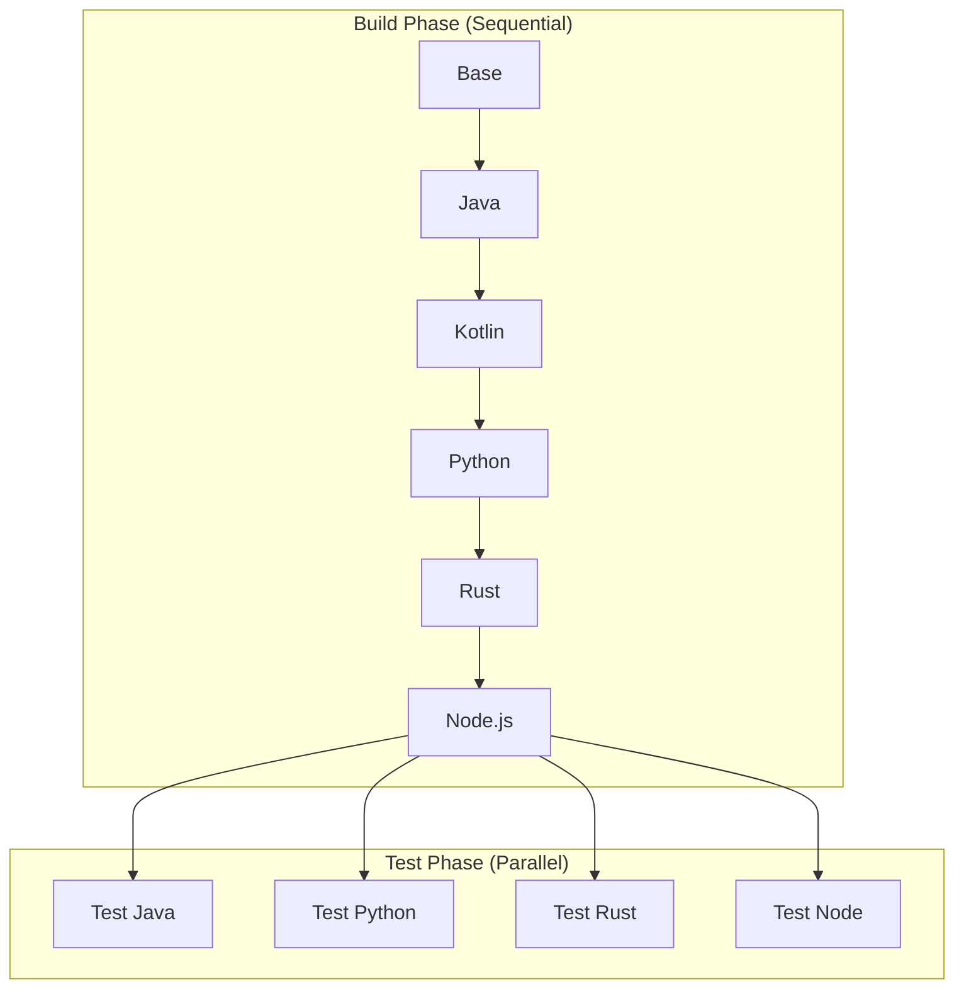

# Parallel Build Strategies - Reality Check

## The Problem: Linear Docker Inheritance

Docker images follow a strict single-parent inheritance model:

```
Ubuntu → Build-Tools → Java → Kotlin → Clojure → Python → ...
```

**You CANNOT do this in Docker:**
```
        ┌→ Kotlin ─┐
Java ───┼→ Python ─┼─→ Merge???  ❌ NOT POSSIBLE
        └→ Rust ───┘
```

## Real Parallel Build Strategies

### Strategy 1: Build Stages Separately, Combine via COPY (Current Best Practice)

This is what multi-stage builds actually do:

```dockerfile
# Build Python in isolation
FROM ubuntu:22.04 AS python-builder
RUN install-python.sh
# Python installs to /opt/python

# Build Rust in isolation
FROM ubuntu:22.04 AS rust-builder
RUN install-rust.sh
# Rust installs to /opt/rust

# Build Node in isolation
FROM ubuntu:22.04 AS node-builder
RUN install-nodejs.sh
# Node installs to /opt/node

# Final stage - COPY from all builders
FROM ubuntu:22.04 AS final
COPY --from=python-builder /opt/python /opt/python
COPY --from=rust-builder /opt/rust /opt/rust
COPY --from=node-builder /opt/node /opt/node
```

**Pros:**
- True parallel building in CI
- Smaller intermediate images
- Better caching

**Cons:**
- Must ensure no file conflicts
- Need careful PATH management
- Dependencies might not be portable

### Strategy 2: Independent Testing, Sequential Building (What We Actually Built)



This is what our current setup does - builds sequentially but can TEST in parallel.

### Strategy 3: Parallel CI Jobs with Artifacts (GitHub Actions Approach)

```yaml
jobs:
  # These run in PARALLEL as separate CI jobs
  build-python:
    runs-on: ubuntu-latest
    steps:
      - build Python container
      - save as artifact

  build-rust:
    runs-on: ubuntu-latest
    steps:
      - build Rust container
      - save as artifact

  build-node:
    runs-on: ubuntu-latest
    steps:
      - build Node container
      - save as artifact

  # This waits for ALL parallel jobs
  combine:
    needs: [build-python, build-rust, build-node]
    steps:
      - download all artifacts
      - combine into final image using COPY approach
```

### Strategy 4: Tool-Specific Base Images (Microservice Approach)

Instead of one giant image, maintain separate images:

```bash
jon-babylon-java:latest    # Just Java tools
jon-babylon-python:latest  # Just Python tools
jon-babylon-node:latest    # Just Node tools
jon-babylon-rust:latest    # Just Rust tools
```

Then users choose what they need:
```yaml
# docker-compose.yml
services:
  java-dev:
    image: jon-babylon-java:latest

  python-dev:
    image: jon-babylon-python:latest

  web-dev:
    image: jon-babylon-node:latest
```

## What Our Current Architecture Really Does

Our staged build is **sequential** but enables:

1. **Parallel CI job execution** - Different stages can be built on different machines
2. **Parallel testing** - Tests can run simultaneously after build
3. **Incremental updates** - Rebuild from any stage without starting over

The "parallel" in the GitHub Actions workflow means:
- Multiple CI runners building different parts
- NOT multiple Docker parents merging

## The Correct Approach for Jon-Babylon

### Option A: Keep Sequential (Simplest, Most Reliable)
```dockerfile
Base → Java → Python → Rust → Node → Final
```
- ✅ Simple dependency management
- ✅ Everything guaranteed to work together
- ❌ Slower builds
- ❌ Larger intermediate images

### Option B: Multi-Stage with COPY (More Complex, Faster)
```dockerfile
# Parallel builds
Base → Python-Builder → /opt/python
Base → Rust-Builder → /opt/rust
Base → Node-Builder → /opt/node

# Combine
Base → Java → COPY all → Final
```
- ✅ Faster parallel builds
- ✅ Smaller builders
- ❌ Complex path/dependency management
- ❌ Potential conflicts

### Option C: Hybrid Approach (Recommended)
```dockerfile
# Sequential for tightly coupled tools
Base → Build-Essential → Java → JVM-Tools

# Parallel for independent tools (via COPY)
Base → Python-Builder
Base → Rust-Builder
Base → Node-Builder

# Final assembly
JVM-Tools + COPY(Python,Rust,Node) → Final
```

## Implementation Fix for True Parallel Building

Here's how we could modify our setup for actual parallel builds:

```dockerfile
# docker/stages/05-python-standalone.Dockerfile
FROM ubuntu:22.04 AS python-standalone
# Install Python in isolation to /opt/python
WORKDIR /opt/python-install
COPY tools/python/install/install.sh .
RUN ./install.sh --prefix=/opt/python

# docker/stages/07-rust-standalone.Dockerfile
FROM ubuntu:22.04 AS rust-standalone
# Install Rust in isolation to /opt/rust
WORKDIR /opt/rust-install
COPY tools/rust/install/install.sh .
RUN ./install.sh --prefix=/opt/rust

# docker/stages/11-final-parallel.Dockerfile
FROM jon-babylon:04-clojure AS final
# Copy from parallel builders
COPY --from=python-standalone /opt/python /opt/python
COPY --from=rust-standalone /opt/rust /opt/rust
ENV PATH=/opt/python/bin:/opt/rust/bin:$PATH
```

## Conclusion

**Reality:** Docker doesn't support multiple inheritance. Each image has exactly one parent.

**Our Current Design:** Sequential building with parallel testing capabilities.

**True Parallel Building:** Requires either:
1. Building independent tools in isolation and copying artifacts
2. Maintaining separate tool-specific images
3. Using CI parallelization at the job level, not Docker level

The staged approach we built is actually the most reliable for a monolithic polyglot image. For true parallel builds, we'd need to redesign with the COPY approach or split into multiple smaller images.