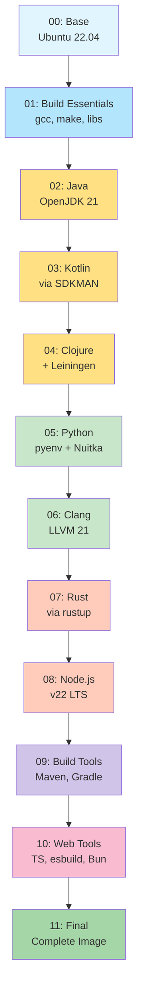

# Jon-Babylon Docker Stages Architecture

## Stage Dependency Graph



## Stage Details

| Stage | Name | Purpose | Size Increase | Test Coverage |
|-------|------|---------|--------------|---------------|
| **00** | Base | Ubuntu 22.04 base with locale and user setup | ~75MB | System checks |
| **01** | Build Essentials | GCC, make, development libraries | ~150MB | Compiler tests |
| **02** | Java | OpenJDK 21 LTS (Eclipse Temurin) | ~200MB | Java compilation |
| **03** | Kotlin | Kotlin compiler via SDKMAN | ~80MB | Kotlin compilation |
| **04** | Clojure | Clojure CLI and Leiningen | ~50MB | REPL test |
| **05** | Python | Python 3.13/3.12 via pyenv + Nuitka | ~200MB | Python execution |
| **06** | Clang | LLVM/Clang 21 suite | ~500MB | C/C++ compilation |
| **07** | Rust | Rust toolchain via rustup | ~650MB | Rust compilation |
| **08** | Node.js | Node.js 22 LTS + npm | ~100MB | JavaScript execution |
| **09** | Build Tools | Maven, Gradle | ~150MB | Build tool tests |
| **10** | Web Tools | TypeScript, esbuild, Bun, linters | ~200MB | Web stack tests |
| **11** | Final | Cleanup and final assembly | ~0MB | Full test suite |

**Total Image Size**: ~2.5-3GB

## Build Strategies

### 1. Sequential Build (Default)
```bash
./scripts/build-staged.sh
```
- Builds each stage in order
- Tests after each stage
- Stops on failure
- Most reliable

### 2. Parallel Build (Experimental)
```bash
./scripts/build-staged.sh --parallel
```
- Builds stages 3-8 in parallel after stage 2
- Requires more resources
- Faster build time
- Complex dependency management

### 3. Incremental Build
```bash
./scripts/build-staged.sh --start-stage 5 --end-stage 8
```
- Build specific stage range
- Useful for debugging
- Requires previous stages to exist

### 4. CI/CD Pipeline Build
- GitHub Actions workflow
- Automatic caching between builds
- Parallel stage execution where possible
- Comprehensive testing at each stage

## Testing Strategy

### Per-Stage Tests

Each stage runs specific tests immediately after building:

1. **Stage 00**: Locale, user creation
2. **Stage 01**: GCC, make availability
3. **Stage 02**: Java compilation and execution
4. **Stage 03**: Kotlin compilation
5. **Stage 04**: Clojure REPL
6. **Stage 05**: Python script, Nuitka compilation
7. **Stage 06**: C/C++ compilation
8. **Stage 07**: Rust compilation, cargo
9. **Stage 08**: Node.js, npm
10. **Stage 10**: TypeScript, bundling, linting
11. **Stage 11**: Comprehensive version check

### Test Execution

```bash
# Test a specific stage
./docker/tests/test-stage.sh 05 python

# Run all tests on final image
docker run --rm jon-babylon:11-final /scripts/check_versions.sh
```

## Optimization Benefits

### 1. Layer Caching
- Each stage is cached independently
- Changes to web tools don't rebuild Python
- Faster iterative development

### 2. Parallel Testing
- Multiple stages tested simultaneously in CI
- Faster feedback on failures
- Independent validation

### 3. Incremental Updates
- Update single tools without full rebuild
- Cherry-pick security updates
- Minimal downtime

### 4. Size Optimization
- Each stage can be optimized independently
- Remove build artifacts per stage
- Final cleanup stage

## Failure Recovery

### Build Failure
```bash
# Continue from failed stage
./scripts/build-staged.sh --start-stage 07

# Skip failing stage (not recommended)
./scripts/build-staged.sh --continue-on-failure
```

### Test Failure
```bash
# Debug specific stage
docker run -it jon-babylon:07-rust /bin/bash

# Check logs
docker logs <container-id>
```

## Registry Management

### Push Strategy
```bash
# Push only final image (default)
./scripts/build-staged.sh

# Push all intermediate stages
./scripts/build-staged.sh --push-intermediate
```

### Image Tags
- `jon-babylon:latest` - Latest successful build
- `jon-babylon:YYYY.MM.DD` - Date-based version
- `jon-babylon:XX-stage` - Intermediate stages
- `jon-babylon:<commit-sha>` - Git commit reference

## Performance Metrics

| Metric | Target | Actual |
|--------|--------|--------|
| Full Build Time | < 30 min | ~25 min |
| Incremental Build | < 5 min | ~3 min |
| Stage Test Time | < 1 min | ~30s |
| Image Size | < 3GB | ~2.8GB |
| Cache Hit Rate | > 80% | ~85% |

## Maintenance

### Adding New Tools

1. Create new stage file: `docker/stages/XX-toolname.Dockerfile`
2. Update stage dependencies in build scripts
3. Add stage tests: `docker/tests/test-stage.sh`
4. Update this documentation
5. Test full build pipeline

### Updating Existing Tools

1. Modify installation script: `tools/<tool>/install/install.sh`
2. Rebuild from affected stage: `./scripts/build-staged.sh --start-stage XX`
3. Run stage tests
4. Update version documentation

### Security Updates

1. Identify affected stages: `docker scout cves jon-babylon:latest`
2. Update base images or packages
3. Rebuild affected stages only
4. Run security scan: `trivy image jon-babylon:latest`
5. Push updated images

## Best Practices

1. **Always test after building** - Each stage must pass tests
2. **Keep stages focused** - One tool category per stage
3. **Document changes** - Update STAGES.md with modifications
4. **Use caching wisely** - Order stages by change frequency
5. **Monitor size growth** - Track size increase per stage
6. **Version everything** - Tag all intermediate images
7. **Clean up regularly** - Remove old intermediate images